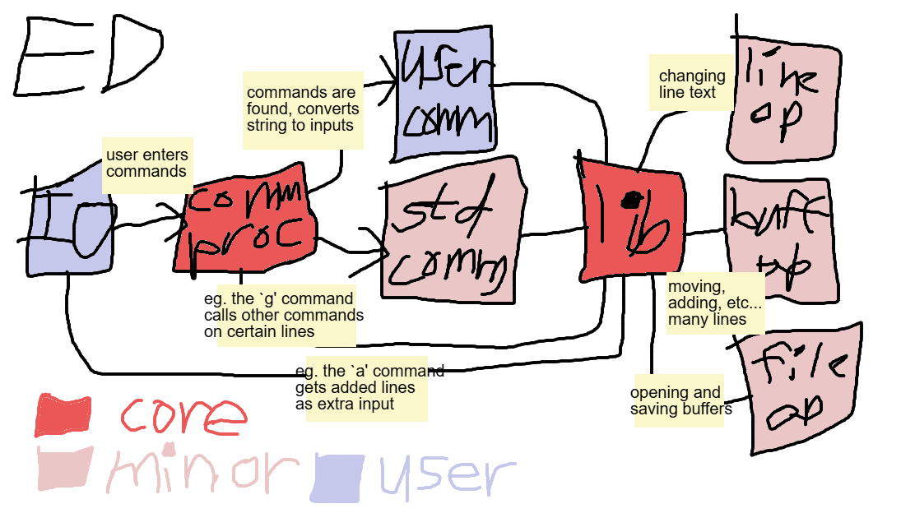

# z-ed

Nothing notable, as this is unfinished.
Any help you give in the project will be helpful.




## building

to build normally, run:
```bash
cmake .
cmake --build build
make
```

for debugging, use the build type for that:
```bash
cmake -DCMAKE_BUILD_TYPE=Debug .
cmake --build build
make
```
